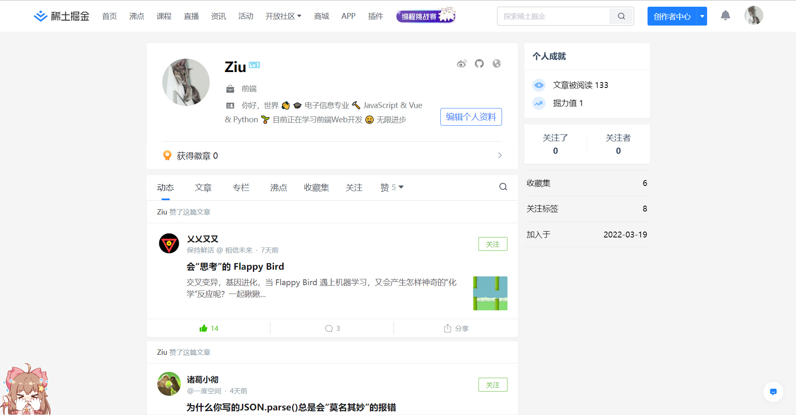

## A-Soul 浏览器宠物 (A-Soul Browser Pet)

在浏览器里养一只A-Soul成员当宠物。

### 🔰安装方法

Chrome浏览器：

* 进入`设置/扩展程序`
* 启用右上角“开发者模式”
* 点击“加载已解压的扩展程序”，选择项目文件夹

### 🏓使用方法

打开任意网页，即可看到一只可爱小然出现在你的页面上。

#### 支持的互动方式：

* 拖拽：小然会跟随鼠标改变位置并变换表情
* 点击：小然会变换不同的表情
* 跟随鼠标：小然会不断跟随鼠标位置
* 跟随点击：小然会追逐最近点击鼠标的位置 *（推荐）*

#### 附加功能：

* 整点报时：小然会在每个整点为你报时

#### 支持修改的配置：

除了小然，还有其他四位A-Soul成员可以配置，点击扩展按钮，在弹出框中进行配置。

* 生成诱饵：每位成员都对应着不同的诱饵，会在点击鼠标后展示
* 固定方式：每位成员相对页面固定/相对浏览器窗口定位
* 速度：每位成员追踪鼠标/追踪点击位置时的速度

### 🚚开发相关

#### 项目技术栈：

项目使用 jQuery + MDUI 完成，jQuery用于替代原生 DOM 操作，更方便的操作元素属性、添加与解除监听器；MDUI用于构建弹窗配置页的界面。

#### 项目结构：

src
 ├── background.js    // service_worker脚本
 ├── css                        // 存储样式文件
 ├── index.js               // 注入页面的content_scripts脚本
 ├── lib                         // 依赖的外部库
 ├── manifest.json     // Chrome 扩展的描述文件
 ├── popup.html        // 弹窗页的.html文件
 ├── popup.js              // 弹窗页的.js文件
 └── static                   // 存储静态文件如图片、图标

