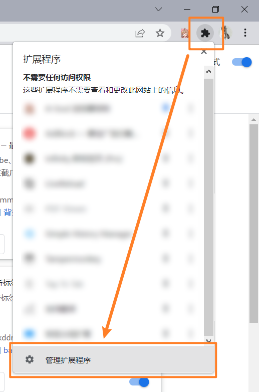
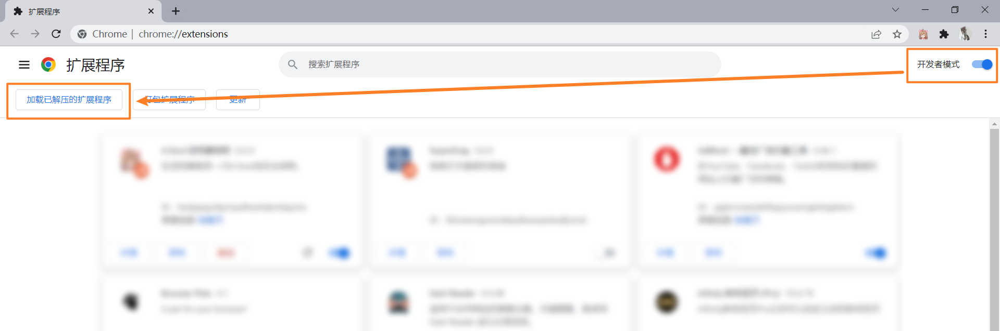
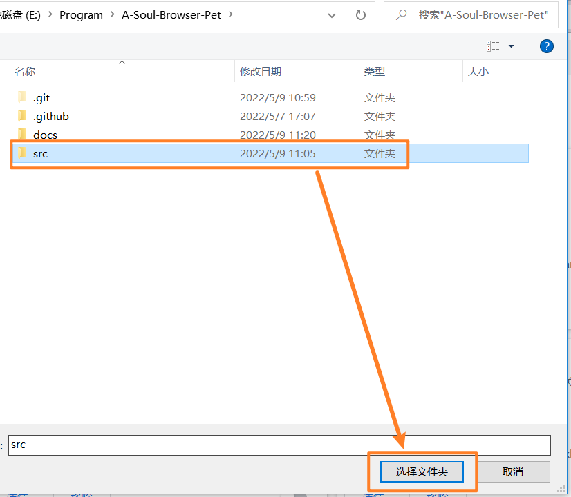
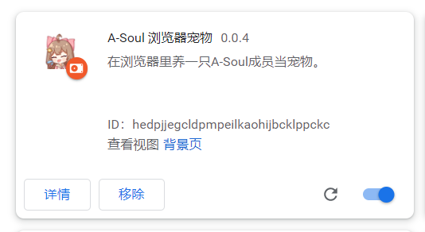
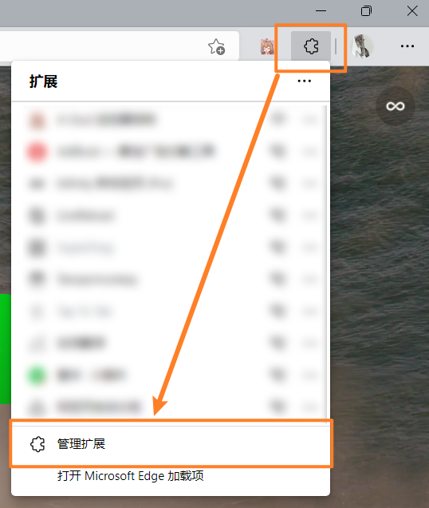
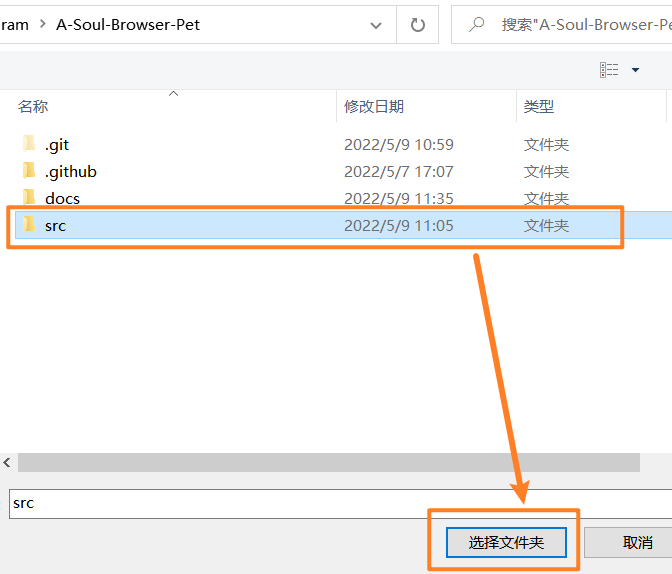

## Chrome浏览器

下载 `.zip` 安装包并解压缩。

1. 进入**设置/扩展程序**
2. 启用右上角 **“开发者模式”**
3. 点击 **“加载已解压的扩展程序”**，选择项目下的src目录

## Edge浏览器

**METHOD1**: 访问[扩展商店](https://microsoftedge.microsoft.com/addons)，搜索“A-Soul 浏览器宠物”，点击安装即可。

**METHOD2**: 下载 `.zip` 安装包并解压缩。

## FireFox浏览器

**METHOD1**: 访问[附加组件商店](https://addons.mozilla.org)，搜索“A-Soul 浏览器宠物”，点击安装即可。